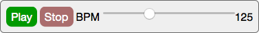

# openmusic-transport

> A transport control web component



[](https://nodei.co/npm/openmusic-transport/)

## Installation

Since this component requires other components, it is not possible to use it without a build step. Please do `npm install openmusic-transport` to get it installed along with all required dependencies.

To use it, you will need to load and then register the module--it is not automatically registered!

```javascript
require('openmusic-transport').register('openmusic-transport');
```

But you could even register it with other name, for example:

```javascript
require('openmusic-transport').register('mega-transport');
```

## Usage

Have a look at `demo/demo.js` for an example that listens to the events the transport dispatches, and prints the info to a text field.

To build the demo, run `npm run build`, and then open `demo/index.html` in your browser.

### Styling

The component doesn't have any styling on its own.

To style it, you can write CSS rules targetting the `openmusic-transport` element (or whichever other name you chose when registering, e.g. `mega-transport`), and also rules for the components inside it. For example:

```css
openmusic-transport {
	display: inline-block;
	padding: 1rem;
	border: 1px solid red;
}

openmusic-transport input[type=button] {
}

```

The demo has a stylesheet for styling the component and its children elements.

<!--
### Attributes

#### `attribute`

Explanation of attribute.

Examples:

```javascript
<openmusic-transport attribute="-1"></openmusic-transport>
```
-->

### Events

#### `play`

This event will be dispatched when the `play` button is clicked. To listen for `play` events on this component, add an event listener:

```javascript
component.addEventListener('play', function(ev) {
	// do something
});
```

#### `stop`

This event will be dispatched when the `stop` button is clicked. To listen for `stop` events on this component, add an event listener:

```javascript
component.addEventListener('stop', function(ev) {
	// do something
});
```

#### `bpm`

This event will be dispatched when the user interacts with the `bpm` slider. To listen for `bpm` events on this component, add an event listener:

```javascript
component.addEventListener('bpm', function(ev) {
	// do something with the bpm value
	console.log('new bpm value', ev.detail.value);
});

